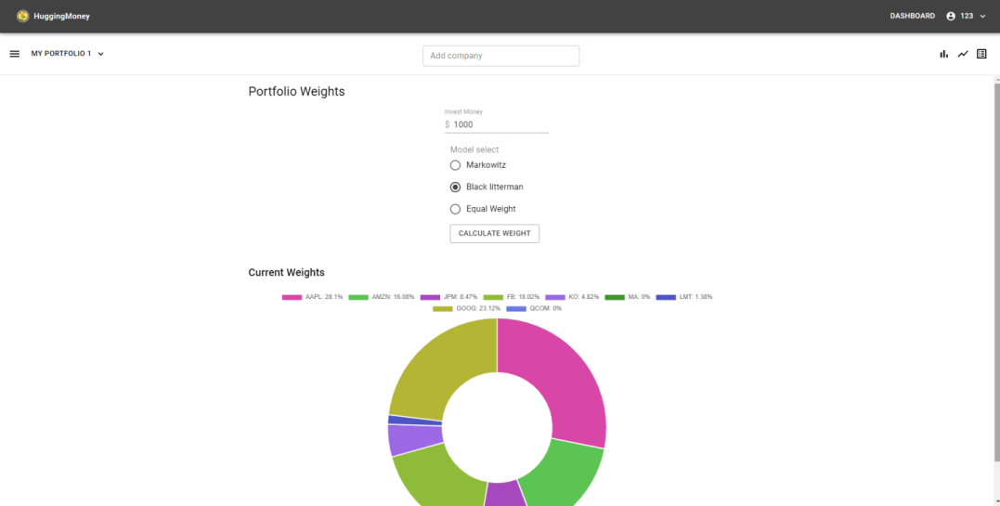

# Intelligent Asset Allocation

<!-- TABLE OF CONTENTS -->
## Table of Contents

* [About the Project](#about-the-project)
  * [Built With](#built-with)
* [Getting Started](#getting-started)
  * [Prerequisites](#prerequisites)
  * [Installation](#installation)
* [Usage](#usage)
* [Contributors](#contributors)
* [License](#license)


<!-- ABOUT THE PROJECT -->
## About The Project



This is a [MVP](https://en.wikipedia.org/wiki/Minimum_viable_product) of asset allocation web application, which can help users build their stock portfolio using model like [Black-litterman](https://en.wikipedia.org/wiki/Black%E2%80%93Litterman_model).

### Built With
* [Flask](https://getbootstrap.com)
* [React.js](https://jquery.com)
* [Tensorflow](https://laravel.com)


<!-- GETTING STARTED -->
## Getting Started

There are two ways to run this project in your machine, only need to follow one instruction.

### 1. Docker

1. Clone the repo
```sh
git clone https://github.com/henry32144/intelligent-asset-allocation.git
```
2. Build docker image
```sh
cd intelligent-asset-allocation


docker build -t intelligent-asset-allocation . --no-cache
```
3. Run docker
```sh
docker run intelligent-asset-allocation
```
4. Open your browser and type `127.0.0.1:5000` in url


### 2. Normal way

#### Prerequisite

* Python 3.7

#### Instruction

1. Clone the repo
```sh
git clone https://github.com/henry32144/intelligent-asset-allocation.git
```
2. Install the libraries
```sh
cd intelligent-asset-allocation

#For Windows user, you need to remove the gunicorn, gevent in the requirements.txt
pip install -r requirements.txt
```
3. Run Flask server
```sh
python app.py
```
4. Open your browser and type `127.0.0.1:5000` in url

<!-- USAGE EXAMPLES -->
## Usage

*All data are stored in your local database.* 

Steps to use this website.

1. *Login.* You can use default account to login, email and password are 123.
2. *Go to dashboard page.* Press `Start Now` or `Dashboard` button on the top right of the page.
3. *Modify Portfolio.* You can add companies on the search box, remove companies on the left panel.
4. *Calculate Portfolio Weight.* Once you finished company selection, you can press calculate weight button. The result should be displayed in few seconds.


<!-- CONTRIBUTING -->
## Contributors

[Dennis Wu](https://github.com/Hibb-bb)

[Cheng-Han Wu](https://github.com/henry32144)

[Yang Wang](https://github.com/penguinwang96825)

[Sam Hsia](https://github.com/HsiaSharpie)

<!-- LICENSE -->
## License

Distributed under the MIT License. See `LICENSE` for more information.